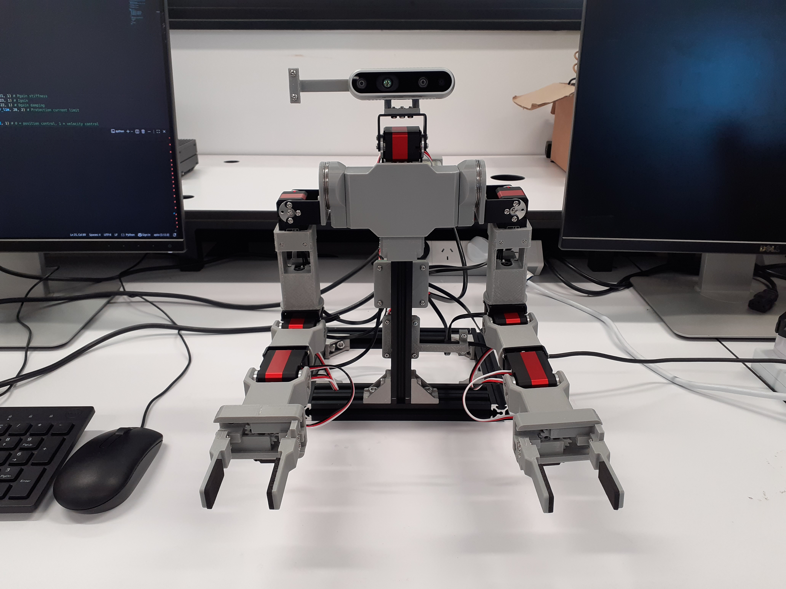

# Apto

Bimanual manipulation platform
* Two 6-DoF arms + two 1-DoF parallel grippers + 1-DoF neck (total 15 DoF)
* Waveshare servos (CF35-12 + ST3025)
* 3D printed parts + aluminium servo frames

<div style="display: flex; justify-content: center">
    
</div>

## Directory Guide

```
apto/
├── API/                           ## API for controlling robot
│   ├── cfservo_sdk/
│   │   ├── __init__.py
│   │   ├── group_sync_read.py
│   │   ├── group_sync_write.py
│   │   └── ...
│   ├── client.py
│   ├── main.py
│   ├── requirements.txt
│   └── README.md
├── Docs/                          ## Information on constructing robot
│   ├── bill_of_materials.md
│   ├── assembly_instructions.md
│   └── README.md
├── Hardware/                      ## Hardware files for 3D printing and PCB
│   ├── PCB/
│   │   ├── robot_pdb.pro
│   │   └── ...
│   ├── STEP/
│   │   ├── base1.step
│   │   └── ...
│   ├── STL/
│   │   ├── base1.stl
│   │   └── ...
│   └── README.md
├── Media/                         ## Images/GIFs
│   ├──
│   └── robot.jpg
├── LICENSE
└── README.md
```

<!-- ## Simulation

For simulation, refer to the [apto_sim](https://github.com/apaik458/apto_sim) repo -->

## Acknowledgements

Inspiration and reference from the following projects:
* [Rakuda-2](https://github.com/ROBOTIS-JAPAN-GIT/rakuda2_example)
* [Hitachi Bimanual Robot](https://monoist.itmedia.co.jp/mn/articles/2603/24/news056.html)
* [SO-ARM100](https://github.com/TheRobotStudio/SO-ARM100)
* LEAP Hand ([API](https://github.com/leap-hand/LEAP_Hand_API), [Power distribution board](https://github.com/leap-hand/LEAP_Power))
* [Techniccontroller Parallel Gripper](https://techniccontroller.com/3d-printed-parallel-gripper/)